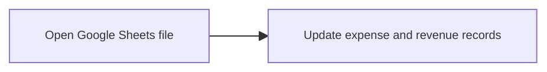

# Monthly Expense Tax Information Workflow

This process outlines the steps to extract, clean, and categorize expense invoices from the SAT portal for monthly reporting.

## Phase 1 — Egress Data Extraction

### 1. Set Up

1. Access the Portal  
   - Log into the SAT Factura Electrónica portal using your RFC and e.firma or Contraseña.
2. Navigate  
   - Go to **Consultar Facturas Recibidas**.
3. Filter  
   - Select the specific reporting month and year.
4. Copy and paste onto a blank Google Sheet

### 2. Column Filtering

Retain only the relevant columns. Delete all others:

- Folio Fiscal (UUID)
- RFC Emisor
- Nombre o Razón Social del Emisor
- Fecha Emisión
- Total
- Efecto
- Estatus
- Estado del Comprobante

### 3. Record Filtering

- Apply a filter to the `Efecto` column:
  - Keep: **Ingreso**
  - Remove: **Anything else** (e.g., Pago, Egreso, Traslado)  

### 4. Categorization & Sorting

| Category | Identification Logic | Action |
|---|---|---|
| Nómina | Records where the Emisor is the employer or contains payroll-related terms (e.g., "Nómina") | Move to a separate section/sheet |
| Medical | Invoices with specific RFCs or keywords (e.g., hospitals, farmacias, doctors) | Move to a separate section/sheet |
| General Expenses | All remaining `Ingreso` records | Maintain in the primary list |

### 5. Final Review

- Verify `Estado del Comprobante` is **Vigente**.
- Flag or remove `Cancelado` invoices to avoid overstating expenses.

### 6. Record expenses in Journal template

- Update Google Sheets template

[Tax preparation map](https://photos.google.com/share/AF1QipP0N1JYkW5i07xTuT3GWW9Y7HAsD0RFcHQpp0mLXSpvVmIHc3Pz6y0OdqIeN_tftg/photo/AF1QipN7or3_tJRaH1_Tu84AOy1cJyrqDY9-xSchB_Ou?key=N014d0lfZkZmb0dIaTF2dTBYSkpvSFNvMjRnenN3)

```mermaid
%%{
  init: {
    'flowchart': {
      'useMaxWidth': false,
      'htmlLabels': true
    },
    'themeVariables': {
      'fontSize': '10px'
    }
  }
}%%
flowchart LR
    %% Phase 1: Data Extraction
    direction LR
    A1["Log into SAT Portal<br/>(RFC + e.firma)"] --> A2["Navigate to<br/>'Facturas Recibidas'"]
    A2 --> A3["Filter Month & Year"]
    A3 --> A4["Copy & Paste into<br/>Google Sheets"]

    %% Phase 2: Cleaning & Transformation
    direction LR
    B1["Column Filtering<br/>(Keep UUID, RFC, Total, etc.)"] --> B2["Record Filtering<br/>(Keep 'Ingreso' only)"]

    %% Phase 3: Categorization
    direction LR
    C0{"Identify Category"}
    C0 -- "Payroll Terms" --> C1["Nómina Section"]
    C0 -- "Medical RFCs/Keywords" --> C2["Medical Section"]
    C0 -- "Remaining" --> C3["General Expenses"]

    %% Phase 4: Final Review
    direction LR
    F1["Verify Status = Vigente"] --> F2["Remove Cancelled"]

    %% Phase 5: Record Expenses
    direction LR
    F2["Remove Cancelled"] --> G1["Record Expenses"]

    %% Inter-phase Connections
    A4 --> B1
    B2 --> C0
    C1 --> F1
    C2 --> F1
    C3 --> F1

    %% Styling
    style C0 fill:#fff4d,stroke:#d4a017
 ```

## Phase 2 — Record ledger with expenses

- Log into ADempiere and create GL Journal entry for the period expenses
- Get 'IVA por Cobrar' Report

```mermaid
%%{
  init: {
    'flowchart': {
      'useMaxWidth': false,
      'htmlLabels': true
    },
    'themeVariables': {
      'fontSize': '10px'
    }
  }
}%%
flowchart LR
    A["Log into ADempiere"] --> B["Create GL Journal Entry<br/>(Period Expenses)"] --> C["Get 'IVA por Cobrar'<br/>Report"]
```

## Phase 3 — Update Expense and Revenue Records in Google Sheets

- Open Google Sheets file
- Update expense and revenue records



## Phase 4 — Prepare and send Tax Declaration