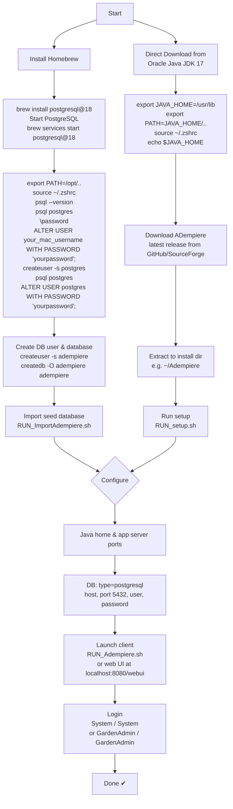
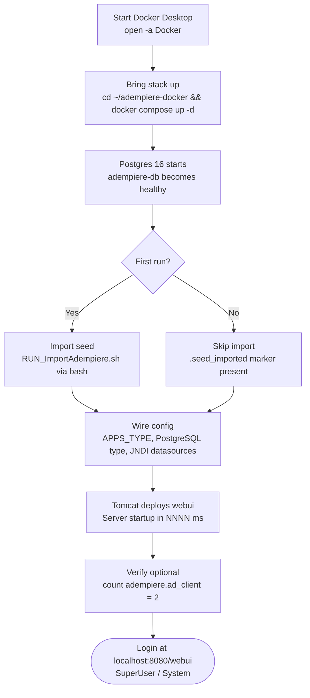

# Adempiere Set Up

[Run Postgres in a Docker Container (Easiest PostgreSQL Setup)](https://www.youtube.com/watch?v=Hs9Fh1fr5s8)

[Descripción del proceso para respaldar la laptop](https://photos.google.com/share/AF1QipNdGDO-fYvfsahJkmghD6AaY-3mP8Qza-BZvOqgu0XHyf5dAdTxXar93gdHpJoHzA/photo/AF1QipOeSJTCM4xpbEiydHf3OrLm2n3sszchqhwUMBTz?key=R19oVEZOa0dsOUZMWDRvTEdpbWZtNVBGNzZjWkZn)

[Configuración de Adempiere](https://photos.google.com/share/AF1QipNwptJ2OFjbft5id--nmX1ONGoEGILclbaFf6SiF-Ak6UMM_KPt1nNp--MgIueytA/photo/AF1QipPeT3JkmfaBQxNIz-IGCtJacv0gRLCPcEzXf0kz?key=YUhZcXdwVzJxUUhqWjlYOFhZNnNGMkE5Mnc0TDRB)

## Accessar  a PostgresSQL

```bash
sudo -u postgres -i
pwd
cd data
pwd
/Library/PostgreSQL/15/data
```

## Ejecutar Adempiere

```text
C:\Users\EnriqueRuibal>@Set CLASSPATH=%ADEMPIERE_HOME%\lib\Adempiere.jar;%ADEMPIERE_HOME%\lib\AdempiereCLib.jar;ADEMPIERE_HOME%\lib\CompiereJasperReqs.jar;%CLASSPATH%
C:\Users\EnriqueRuibal>JAVA -Xms512m -Xmx1024m -DADEMPIERE_HOME=%ADEMPIERE_HOME% -classpath "%CLASSPATH%" org.adempiere.Adempiere
WARNING: sun.reflect.Reflection.getCallerClass is not supported. This will impact performance.
*** 2025-02-04 01:41:08.335 Adempiere Log (CLogConsole) ***
01:41:08.334 Adempiere.startup: ADempiere(r) Release 3.9.4_2023-01-24 - Smart Suite ERP,CRM and SCM - (c) 1999-2023 ADempiere(r) Implementation: ${ADEMPIERE_VERSION} 20250204-0136 - ${ADEMPIERE_VENDOR} [1]
-----------> Ini.loadProperties: C:\Users\EnriqueRuibal\Adempiere.properties not found [1]
01:41:08.363 Ini.loadProperties: C:\Users\EnriqueRuibal\Adempiere.properties #28 [1]
-----------> CConnection.isAppsServerOK: :0
```

```text
eruibal@VXGH744F2P ~ % sudo -u postgres -i
Password:

The default interactive shell is now zsh.
To update your account to use zsh, please run `chsh -s /bin/zsh`.
For more details, please visit https://support.apple.com/kb/HT208050.
VXGH744F2P:~ postgres$ history 
    1  quit
    2  \q
    3  \quit
    4  quit
    5  pwd
    6  pg_dump
    7  cd /Adempiere
    8  pwd
    9  cd /Users/eruibal/
   10  pwd
   11  pwd
   12  cd data
   13  ls -la
   14  pg_dump adempiere > respaldo_3feb.dmp
   15  ls -la
   16  cat respaldo_3feb.dmp 
   17  clear
   18  ls -la
   19  rm respaldo_3feb.dmp 
   20  pg_dump adempiere > /Users/eruibal/Adempiere/data/respaldo_3feb.dmp
   21  pg_dump adempiere > /Users/eruibal/Adempiere/data/respaldo_3feb.dmp
   22  pg_dump adempiere > respaldo_3feb.dmp
   23  ls -la
   24  exit
   25  history 
   26  pwd
   27  pwd
   28  cd data
   29  pwd
   30  ls -la
   31  sudo mv respaldo_3feb.dmp /Users/eruibal/Adempiere/data
   32  sudo mv respaldo_3feb.dmp /Users/eruibal/Adempiere/data
   33  dfsdfasfa
   34  sudo mv respaldo_3feb.dmp /Users/eruibal/Adempiere/data
   35  su mv respaldo_3feb.dmp /Users/eruibal/Adempiere/data
   36  pwd
   37  mv respaldo_3feb.dmp /Library/PostgreSQL/15
   38  cd ..
   39  ls -la
   40  pwd
   41  exit
   42  chmod 777 respaldo_3feb.dmp 
   43  exit
   44  chown respaldo_3feb.dmp root
   45  chown respaldo_3feb.dmp eruibal
   46  chown root respaldo_3feb.dmp 
   47  chown eruibsl respaldo_3feb.dmp 
   48  sudo chown eruibal:staff respaldo_3feb.dmpt
   49  chown eruibal:staff respaldo_3feb.dmpt
   50  pwd
   51  chown eruibal:staff respaldo_3feb.dmp
   52  exit
   53  psql
   54  pg_backup
   55  pg_restore
   56  pwd
   57  cd ˜
   58  pwd
   59  cd ..
   60  pwd
   61  cd ..
   62  cd ..
   63  cd ..
   64  cd ..
   65  pwd
   66  ls -la
   67  cd opt
   68  ls -la
   69  vim prueba.txt
   70  ls -la
   71  sudo vim prueba.txt
   72  history 
   73  pg_dump adempiere > respaldo_4feb.dmp
   74  \q
   75  \quit
   76  exit
   77  history 
VXGH744F2P:~ postgres$ 
```

## ADempiere MacOs



## ADempiere Docker



### Docker Commands

- docker compose stop
- docker compose start
- docker compose logs -f app
- [localhost](http://localhost:8080/webui)

- docker compose down (no -v) — remove containers, keep the data.
- Avoid docker compose down -v — that wipes the database and forces a full re-seed.
