# Techaus Landing — Navigation & Visibility Improvement Workflow

> Recommended remediation sequence to fix the click-through experience.
> Author: Enrique Ruibal · Date: 2026-05-31

## Priority Workflow Map

```mermaid
flowchart TD
    Start([Site review complete]) --> P1

    subgraph PHASE1["🔴 Phase 1 — Stop the bleeding (dead links)"]
        direction TB
        P1["Decide: build product pages<br/>OR deep-link to /cotizar?"]
        P1 -->|Build pages| P1a["Create app/proteccion/*<br/>(4 product routes)"]
        P1 -->|Deep-link only| P1b["Point dropdown items<br/>to /cotizar?service=X"]
        P1a --> P1c["Fix Services.tsx card CTAs<br/>(remove href='#')"]
        P1b --> P1c
        P1c --> P1d["Fix Footer 'Enlaces Rápidos'<br/>+ social + legal links"]
        P1d --> P1e["Wire CTA.tsx buttons<br/>+ WhyChoose → /nosotros"]
    end

    P1e --> P2

    subgraph PHASE2["🟠 Phase 2 — Smart quote funnel"]
        direction TB
        P2["Read service via useSearchParams<br/>in /cotizar"]
        P2 --> P2a["Pre-select dropdown<br/>from ?service=X"]
        P2a --> P2b["Connect form to real endpoint<br/>(currently demo-only)"]
    end

    P2b --> P3

    subgraph PHASE3["🟡 Phase 3 — Conversion channels"]
        direction TB
        P3["Add floating WhatsApp button<br/>(wa.me/52...)"]
        P3 --> P3a["Verify real phone + email<br/>(replace placeholders)"]
    end

    P3a --> P4

    subgraph PHASE4["🟢 Phase 4 — Visibility & SEO"]
        direction TB
        P4["Add per-page metadata<br/>(nosotros, cloud-services, cotizar)"]
        P4 --> P4a["Add sitemap.ts + robots.ts"]
        P4a --> P4b["Add LocalBusiness JSON-LD<br/>(Hermosillo broker)"]
        P4b --> P4c["Add OG / Twitter card images"]
    end

    P4c --> P5

    subgraph PHASE5["🔵 Phase 5 — Polish"]
        direction TB
        P5["Active-page highlight in nav<br/>(usePathname)"]
        P5 --> P5a["Replace external Unsplash img<br/>with local team_leadership.png"]
        P5a --> P5b["Upgrade Partners logos<br/>(real brand SVGs)"]
    end

    P5b --> Done([Appealing click-through<br/>experience ✅])

    style PHASE1 fill:#fee2e2,stroke:#dc2626
    style PHASE2 fill:#ffedd5,stroke:#ea580c
    style PHASE3 fill:#fef9c3,stroke:#ca8a04
    style PHASE4 fill:#dcfce7,stroke:#16a34a
    style PHASE5 fill:#dbeafe,stroke:#2563eb
    style Start fill:#f1f5f9,stroke:#475569
    style Done fill:#0c4a6e,stroke:#0c4a6e,color:#ffffff
```

## Step Summary

| # | Phase | Action | Files |
|---|-------|--------|-------|
| 1 | 🔴 Dead links | Repoint/build the Protección dropdown (no 404s) | `components/Navigation.tsx`, `app/proteccion/*` |
| 2 | 🔴 Dead links | Wire service card CTAs | `components/Services.tsx` |
| 3 | 🔴 Dead links | Fix footer quick-links, social, legal | `components/Footer.tsx` |
| 4 | 🔴 Dead links | Make CTA buttons + "Conocer al equipo" clickable | `components/CTA.tsx`, `components/WhyChoose.tsx` |
| 5 | 🟠 Funnel | Deep-link service into quote form, pre-select dropdown | `app/cotizar/page.tsx` |
| 6 | 🟠 Funnel | Connect form to real submission endpoint | `app/cotizar/page.tsx` |
| 7 | 🟡 Conversion | Floating WhatsApp + verify contact info | `components/Footer.tsx`, new component |
| 8 | 🟢 SEO | Per-page metadata, sitemap, robots, JSON-LD, OG images | sub-pages, `app/sitemap.ts`, `app/robots.ts` |
| 9 | 🔵 Polish | Active nav state, local images, real partner logos | `Navigation.tsx`, `WhyChoose.tsx`, `Partners.tsx` |

**Rule of thumb:** Phases 1–2 alone fix the broken journey. Everything after compounds visibility and conversion.
